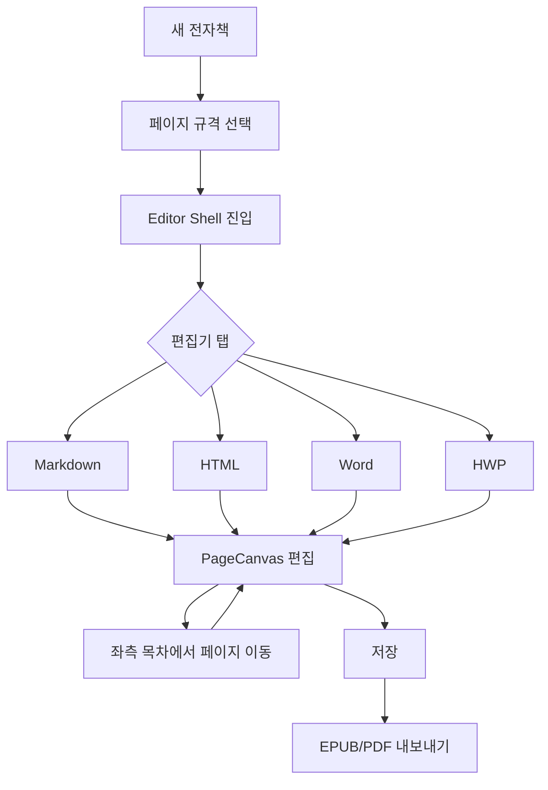

# Book Studio — 멀티 편집기 업그레이드 기획명세서 v1.1

> **문서 버전:** v1.1  
> **작성일:** 2026-06-17  
> **개정:** v1.1 — **PDF 편집기형 UI**, **페이지 규격 사전 설정**, **좌측 목차 네비게이션**, **4대 기본 편집기**(MD/HTML/Word/HWP) UI 상세 설계 반영  
> **대상 프로젝트:** `shinkang888-code/book` (Book Studio)  
> **프로덕션:** https://book-mu-ochre.vercel.app  
> **목적:** PDF 편집기 수준의 **페이지·목차 중심 UX** 위에 HTML·Markdown·Word·HWP **4종 편집기**를 통합한 전자책 제작 스튜디오

---

## 0. 요약 (Executive Summary)

Book Studio는 현재 **Toast UI Editor 1종(Markdown/WYSIWYG)** 과 **EPUB3 단순 내보내기** 수준이다.  
본 명세는 **「하나의 책 = 여러 포맷·여러 편집 모드」** 를 지원하는 **Unified Book Editor Platform** 으로 확장하는 로드맵을 정의한다.

| 구분 | 현재 (AS-IS) | 목표 (TO-BE) |
|------|-------------|--------------|
| UI 패러다임 | 단일 스크롤 에디터 | **PDF 편집기형** — 좌 목차 · 중앙 페이지 캔버스 · 우 속성 |
| 페이지 규격 | 없음 | **책·챕터·페이지 단위 규격 사전 설정** (A4/B5/6×9 등) |
| 편집기 | Markdown/WYSIWYG 1종 | **Markdown · HTML · Word · HWP** 4종 **기본 탑재** |
| 네비게이션 | 없음 | **좌측 계층 목차** + 페이지 썸네일 + 현재 위치 표시 |
| 저장 | `content_md` + `content_html` | CDM + **Page[]** + 포맷별 원본 |
| 내보내기 | EPUB3 (단일 챕터) | EPUB3/PDF (페이지 규격 반영) |

**권장 접근:** 웹앱(`book`)을 **허브**로 두고, 이미 보유한 GitHub 리포(`naverb`, `ebook`/`Sigil`, `hwpreader`, `hwpx-skill`, `lofice`, `microscope-js`, `voice`)를 **편집 엔진·변환·뷰어**로 단계 통합한다.

---

## 1. 배경 및 문제 정의

### 1.1 사용자 Pain Point

| # | 문제 | 영향 |
|---|------|------|
| P1 | Markdown만 지원, HTML 직접 편집 불가 | EPUB/CSS 세밀 제어 불가 |
| P2 | HWP·Word 원고 import 불가 | 한국 출판·법무·학술 시장 진입 장벽 |
| P3 | 단일 WYSIWYG 품질 한계 | 표·각주·수식·목차·양면 레이아웃 부족 |
| P4 | EPUB export가 단일 HTML 묶음 | 다챕터·메타데이터·목차(NCX/nav) 미흡 |
| P5 | 이미지 base64 이슈 (v0.2에서 URL 업로드로 해결) | 대용량·재사용·CDN 필요 → Storage 기반 확장 필요 |
| P7 | PDF·인쇄 관점 UI 부재 | 페이지 여백·면·크기 조정 불가 |

### 1.2 기회

- Supabase(`book` 프로젝트), Vercel, Figma 디자인 시스템, Storage(`book-images`) **인프라 구축 완료**
- `shinkang888-code` 계정에 **문서·EPUB·HWP 관련 포크 10+개** 보유
- Loyad 명세에서 **ebook/naverb Phase 7** 로 이미 로드맵 합의

---

## 2. AS-IS 아키텍처

```
┌─────────────────────────────────────────────────────────┐
│  Book Studio (Next.js 16)                               │
│  ┌─────────────┐  ┌──────────────┐  ┌─────────────────┐ │
│  │ BookList    │  │ BookEditor   │  │ BookPreview     │ │
│  └─────────────┘  │ Toast UI MD  │  └─────────────────┘ │
│                   └──────────────┘                      │
│  API: /api/books, /api/upload/image, /api/.../export    │
└──────────────────────────┬──────────────────────────────┘
                           │
              ┌────────────┴────────────┐
              │ Supabase (books 테이블)  │
              │ Storage (book-images)   │
              └─────────────────────────┘

별도: Sigil 2.8.0 (데스크톱), ebook(Magic) C++ 소스
```

### 2.1 현재 데이터 모델

```typescript
Book {
  id, title, author,
  content_md, content_html,  // 이원화, 동기화 수동
  status, created_at, updated_at
}
```

### 2.2 현재 편집기 한계 (Toast UI Editor 3.2)

- Markdown ↔ WYSIWYG 전환만 지원
- HTML 소스 직접 편집·구문 강조 없음
- HWP/DOCX 네이티브 불가
- EPUB OPF/NCX/spine 개념 없음
- 협업·버전·댓글 없음

---

## 3. TO-BE 비전: Unified Book Editor Platform

### 3.1 제품 정의

**「Book Studio Pro」** — **Adobe Acrobat / Foxit PDF Editor** 와 유사한 **3-Zone 레이아웃** 위에서 전자책을 **페이지 단위**로 편집하는 IDE.

**핵심 UX (PDF 편집기 벤치마크):**

| Zone | 역할 | PDF 편집기 대응 |
|------|------|----------------|
| **좌측 (240–280px)** | **목차(TOC) + 페이지 썸네일** 네비게이션 | Bookmarks / Page Thumbnails |
| **중앙 (flex)** | **페이지 캔버스** + 4종 편집기 탭 | Document View + Edit Mode |
| **우측 (280–320px)** | 페이지 규격·여백·메타·스타일 | Properties / Preflight |
| **상단 (48px)** | 앱 바 + 문서명 + 저장·발행·내보내기 | Toolbar / File Menu |
| **편집기 서브바 (40px)** | MD / HTML / Word / HWP 탭 + 서식 툴바 | Edit Tools |
| **하단 (28px)** | 페이지 번호 · 줌 · 규격 · 저장 상태 | Status Bar |

**4대 기본 편집기 (필수·동급 탭):**

1. **Markdown** — 원고 초안·GFM·수식  
2. **HTML** — EPUB XHTML/CSS 정밀 제어  
3. **Word** — DOCX import/export·리치 편집  
4. **HWP** — 한글 원고 import·뷰어·변환  

> Preview·EPUB Source는 **보조 탭**으로 우측 또는 탭 overflow에 배치.

### 3.2 UX 레퍼런스

| 제품 | 차용 요소 |
|------|-----------|
| **Adobe Acrobat** | 좌측 Bookmarks, 페이지 썸네일 strip, 줌·페이지 이동 |
| **Foxit PDF Editor** | 속성 패널, 페이지 삽입/삭제/회전 |
| **Sigil** | EPUB spine·OPF·CodeView/BookView 전환 |
| **한컴 한글** | HWP 면·쪽·바탕쪽 개념 → Page Spec 매핑 |
| **Notion** | 좌측 아웃라인 드래그 (목차 재정렬) |

### 3.3 편집 모드 매트릭스 (v1.1 — 4종 기본)

| 모드 | Phase | 필수 | 1차 엔진 | UI 형태 |
|------|-------|------|----------|---------|
| **Markdown** | **P1** | ✅ | Toast UI / naverb | 페이지 캔버스 내 MD + 우측 split preview |
| **HTML** | **P1** | ✅ | CodeMirror 6 | 페이지 캔버스 좌 코드 / 우 rendered page |
| **Word** | **P1** | ✅ | TipTap + mammoth | 페이지 단위 WYSIWYG (Word-like) |
| **HWP** | **P1** | ✅ | hwpreader WASM | 페이지 미리보기 + 변환본 HTML 편집 연동 |
| Preview | P1 | — | epub.js | 읽기 전용, 규격·디바이스 시뮬 |
| EPUB Source | P2 | — | OPF/NCX 폼 | 우측 패널 또는 모달 |

---

## 4. 목표 아키텍처

```
┌──────────────────────────────────────────────────────────────────┐
│                     BookEditorShell (Next.js)                     │
│  ┌────────────┐ ┌─────────────────────────────────────────────┐  │
│  │ TocNavigator│ │ PageCanvas + EditorTabBar                    │  │
│  │ + Thumbnails│ │  [MD][HTML][Word][HWP][Preview]             │  │
│  └────────────┘ │  ┌─────────────────────────────────────────┐ │  │
│  ┌────────────┐ │  │ FormatToolbar + Active Editor Panel     │ │  │
│  │ PageSpec   │ │  │ (모든 패널 = 동일 Page Spec CSS 적용)      │ │  │
│  │ Panel      │ │  └─────────────────────────────────────────┘ │  │
│  └────────────┘ └─────────────────────────────────────────────┘  │
│  StatusBar — page n/total · 규격 · 편집기 · zoom                   │
└──────────────────────────┬─────────────────────────────────────────┘
                           │
              ┌────────────▼────────────┐
              │ Document Service Layer  │
              │ CDM · Page[] · sync     │
              └────────────┬────────────┘
                           │
        ┌──────────────────┼──────────────────┐
   ┌────▼────┐        ┌────▼────┐       ┌────▼────┐
   │ Import  │        │ Storage │       │ Export  │
   │ Engine  │        │ Service │       │ Engine  │
   └─────────┘        └─────────┘       └─────────┘
```

### 4.1 설계 원칙

1. **Canonical First:** 모든 편집기는 공통 중간 모델(CDM)을 읽고 쓴다.
2. **Plugin Editor:** 편집기마다 독립 React 컴포넌트 + `EditorAdapter` 인터페이스.
3. **Import → Edit → Export:** 가져오기·편집·내보내기 파이프라인 분리.
4. **Progressive Enhancement:** Word/HWP는 뷰어·import부터, 풀 편집은 후속.
5. **Reuse over Rebuild:** 보유 리포·npm 생태계 최대 활용.

---

## 5. Canonical Document Model (CDM)

### 5.1 개념

책 1권 = **Book** → **Chapter[]** → **Block[]** (또는 XHTML fragment)

```typescript
/** v2 데이터 모델 (목표) */
interface BookV2 {
  id: string;
  title: string;
  author: string;
  language: string;
  status: "draft" | "published";
  metadata: BookMetadata;
  /** 책 전체 기본 페이지 규격 (챕터·페이지 override 가능) */
  page_spec: PageSpec;
  spine: ChapterRef[];
  created_at: string;
  updated_at: string;
}

/** 페이지 규격 — PDF 편집기 「문서 속성」에 대응 */
interface PageSpec {
  preset_id: PagePresetId;
  width_mm: number;
  height_mm: number;
  orientation: "portrait" | "landscape";
  margins: { top: number; right: number; bottom: number; left: number }; // mm
  bleed_mm?: number;
  facing_pages: boolean;  // 좌우 면(스프레ad) 미리보기
  columns: 1 | 2;
  line_height: number;
  font_family: string;
  font_size_pt: number;
}

type PagePresetId =
  | "a4" | "a5" | "b5" | "us_letter" | "us_trade_6x9"
  | "novel_kr" | "ebook_kindle" | "ebook_ipad" | "custom";

interface Chapter {
  id: string;
  book_id: string;
  title: string;
  order: number;
  page_spec_override?: Partial<PageSpec>;  // 챕터별 규격 덮어쓰기
  sources: {
    markdown?: string;
    html?: string;
    docx_storage_path?: string;
    hwp_storage_path?: string;
  };
  /** PDF형 페이지 배열 — 편집·썸네일·내보내기 단위 */
  pages: Page[];
  blocks?: ContentBlock[];
  updated_at: string;
}

interface Page {
  id: string;
  chapter_id: string;
  page_number: number;       // 챕터 내 1-based
  global_page_number?: number; // 책 전체 연속 (PDF export용)
  title?: string;            // 목차 leaf 또는 페이지 제목
  /** 렌더된 페이지 HTML fragment (Page Spec CSS 적용) */
  content_html: string;
  thumbnail_url?: string;    // Storage 썸네일 (lazy gen)
}

type ContentBlock =
  | { type: "heading"; level: 1 | 2 | 3; text: string }
  | { type: "paragraph"; html: string }
  | { type: "image"; url: string; alt?: string }
  | { type: "code"; language: string; code: string }
  | { type: "table"; html: string }
  | { type: "footnote"; id: string; content: string };
```

### 5.2 포맷 간 동기화 규칙

| 전환 | 규칙 | 손실 |
|------|------|------|
| MD → HTML | remark/rehype | 없음 (표준 GFM) |
| HTML → MD | turndown + 커스텀 규칙 | 복잡 CSS 일부 |
| DOCX → MD/HTML | mammoth | 스타일·머리글 일부 |
| HWP → HTML | hwpreader WASM + 서버 | 레이아웃·개체 일부 |
| MD/HTML → EPUB XHTML | 템플릿 래핑 | 없음 |

**충돌 정책:** 마지막 저장 편집기가 해당 챕터의 `primary_source`를 갱신. 다른 포맷은 **「재생성」** 버튼으로 동기화.

---

## 6. 편집기 모듈 상세 명세

### 6.1 Markdown 편집기 (Phase 1 — 고도화)

**현재:** `@toast-ui/react-editor`  
**업그레이드:**

| 기능 | 설명 | 우선순위 |
|------|------|----------|
| 이미지 Storage URL | ✅ 완료 | — |
| 다챕터 MD 파일 | 챕터별 `.md` 분리 | P1 |
| GFM+ 확장 | 각주, 수식(MathJax/KaTeX), Mermaid | P1 |
| 슬래시 명령 | `/image`, `/chapter`, `/toc` | P2 |
| AI 보조 | 선택 영역 윤문·요약 (`im-not-ai` 패턴) | P3 |

**파일 구조 (신규):**

```
src/components/editor/markdown/
  MarkdownEditorPanel.tsx      // 기존 래퍼 확장
  markdownExtensions.ts
src/lib/editor/adapters/
  MarkdownEditorAdapter.ts
```

---

### 6.2 HTML 편집기 (Phase 1)

**목적:** EPUB XHTML/CSS 직접 편집 (Sigil CodeView 대응)

| 항목 | 스펙 |
|------|------|
| 엔진 | **CodeMirror 6** (`@codemirror/lang-html`, `@codemirror/lang-css`) |
| 기능 | 구문 강조, 자동 닫힘, Prettier format, 실시간 Preview split |
| 검증 | W3C/XHTML EPUB subset lint (Magic `WellFormedCheck` 로직 참고) |
| 단축키 | Ctrl+S 저장, Ctrl+Shift+F 포맷 |

**UI:** Markdown 탭 옆 **「HTML」** 탭 — 동일 챕터의 `sources.html` 편집.

---

### 6.3 Word (DOCX) 편집기 (Phase 2–3)

**단계적 전략:**

| Phase | 범위 | 기술 |
|-------|------|------|
| **2a Import** | `.docx` 업로드 → MD/HTML 변환 → 챕터 생성 | `mammoth`, Supabase Storage |
| **2b Preview** | DOCX 브라우저 렌더 | `microscope-js` 또는 `@js-preview/docx` |
| **3a Edit** | 브라우저 내 리치 편집 (DOCX 재저장) | TipTap + `docx` npm export |
| **3b Pro** | OnlyOffice/Collabora 임베드 (고 fidelity) | `lofice` 아키텍처 참고 |

**제약:** 완전한 Word 호환은 OnlyOffice급 엔진 없이는 불가 → **「import 후 EPUB용 HTML 정리」** 를 1차 가치로 명시.

---

### 6.4 HWP / HWPX 편집기 (Phase 2–4)

| 포맷 | Phase 2 | Phase 3 | Phase 4 |
|------|---------|---------|---------|
| **HWP (바이너리)** | WASM 뷰어 (`hwpreader`) | HTML 변환 import | 양방향 export (제한적) |
| **HWPX (XML)** | 업로드·파싱 | `hwpx-skill` 기반 생성/편집 | AI 초안 → HWPX export |

**현실적 목표:** HWP **풀 편집기**가 아니라 **「한글 원고 → 전자책 HTML/EPUB 파이프라인」**.

```
HWP/HWPX upload
    → 변환 Worker (Edge Function or Python sidecar)
    → Chapter HTML
    → 사용자 HTML/MD 편집기에서 정제
    → EPUB export
```

---

### 6.5 EPUB 소스 편집기 (Phase 2)

Magic/Sigil 기능을 웹으로 이식 (핵심만):

| 패널 | 기능 |
|------|------|
| **Package (OPF)** | metadata, manifest, spine 폼 편집 |
| **TOC (nav/ncx)** | 드래그 목차 |
| **Assets** | 이미지·CSS·폰트 번들 |
| **Validate** | EPUBCheck (서버 CLI) |

참고: `c:\cursor\ebook\src\Tabs\` (OPFTab, NCXTab, CSSTab, FlowTab)

---

### 6.6 Preview / Reader (Phase 1)

| 기능 | 기술 |
|------|------|
| EPUB 리더 | `epub.js` iframe |
| 디바이스 시뮬레이터 | Magic README — iPhone/Xiaomi 프리셋 CSS |
| 야간 모드 | `prefers-color-scheme` + 테마 토큰 |

---

## 7. Import / Export 파이프라인

### 7.1 Import

| 입력 | API | 출력 |
|------|-----|------|
| `.md` | `/api/import/markdown` | Chapter[] |
| `.docx` | `/api/import/docx` | Chapter[] (mammoth) |
| `.hwp` | `/api/import/hwp` | Chapter[] (hwpreader worker) |
| `.hwpx` | `/api/import/hwpx` | Chapter[] |
| `.epub` | `/api/import/epub` | BookV2 전체 (jszip unzip) |
| `.html` | `/api/import/html` | 단일 Chapter |

### 7.2 Export

| 출력 | API | 엔진 |
|------|-----|------|
| EPUB3 | `/api/books/[id]/export` (확장) | jszip + 다챕터 OPF/nav |
| PDF | `/api/books/[id]/export/pdf` | Puppeteer/Playwright (Vercel 제약 시 Queue) |
| DOCX | `/api/books/[id]/export/docx` | `docx` npm |
| HWPX | `/api/books/[id]/export/hwpx` | `hwpx-skill` |

### 7.3 EPUB Export v2 (다챕터)

현재 단일 `chapter1.xhtml` → **spine 기반 N개 챕터 + nav.xhtml + OPF manifest**.

```
Book
 └── Chapter 1 → OEBPS/ch01.xhtml
 └── Chapter 2 → OEBPS/ch02.xhtml
 └── images/   → Storage URL → EPUB 내부 상대경로로 치환
 └── styles/   → theme.css
```

---

## 8. UI/UX 상세 설계 — PDF 편집기형 레이아웃

### 8.1 전체 레이아웃 (Desktop ≥1280px)

```
┌──────────────────────────────────────────────────────────────────────────────┐
│ AppBar 48px                                                                  │
│ [≡] Book Studio  │ 퀀텀투자의 첫걸음 ▼ │ ● 저장됨 │ [저장][발행][▼내보내기]   │
├──────────┬───────────────────────────────────────────────────┬───────────────┤
│ LEFT     │ CENTER — Editor Canvas                            │ RIGHT         │
│ 260px    │                                                   │ 300px         │
│          │ EditorTabBar 40px                                 │               │
│ [목차][썸네일]│ [Markdown][HTML][Word][HWP] │ Preview │ …     │ [속성][페이지] │
│          ├───────────────────────────────────────────────────┤               │
│ ▼ 1장 서론│ FormatToolbar 36px (탭별 contextual)              │ ▼ 페이지 규격  │
│   · p.1  │ [B I U │ H1-H3 │ 목록 │ 표 │ 이미지 │ 각주 │ …]     │ 프리셋: B5    │
│   · p.2  ├───────────────────────────────────────────────────┤ 방향: 세로     │
│ ▼ 2장 본론│                                                   │ 여백 T/R/B/L  │
│   · p.3  │     ┌─────────────────────────┐                   │ 20/15/20/15mm │
│   · p.4  │     │   PAGE CANVAS (shadow)  │  ← scroll/zoom    │               │
│   · p.5  │     │   실제 페이지 규격 박스   │                   │ ▼ 목차 항목    │
│ + 페이지  │     │   (B5 176×250mm scale)  │                   │ 제목·레벨     │
│ + 챕터   │     │                         │                   │               │
│          │     └─────────────────────────┘                   │ ▼ EPUB/검증   │
│          │ [◀ p.3 / 12 ▶]  zoom 75% 100% 125% fit            │               │
├──────────┴───────────────────────────────────────────────────┴───────────────┤
│ StatusBar 28px — p.3 · 2장 본론 · B5 · Markdown · 1920×1080 preview          │
└──────────────────────────────────────────────────────────────────────────────┘
```

### 8.2 Zone별 상세 스펙

#### 8.2.1 AppBar (상단 고정)

| 요소 | 크기/동작 | 설명 |
|------|-----------|------|
| 햄버거 | 32×32 | 프로젝트 목록·설정 |
| 문서 제목 | truncate | 클릭 시 메타 편집 |
| 저장 상태 | dot + 텍스트 | `저장됨` / `저장 중…` / `변경됨` |
| 주 액션 | Button sm | 저장(Ctrl+S), 발행, 내보내기 드롭다운 |

#### 8.2.2 Left Panel — 목차·네비게이션 (핵심)

**PDF 편집기의 Bookmarks + Thumbnails를 하나의 패널에 통합.**

| 탭 | 내용 | 인터랙션 |
|----|------|----------|
| **목차** | 계층 TOC (챕터 → H1 → H2 → 페이지) | 클릭 시 해당 페이지로 점프 |
| **썸네일** | 페이지 세로 strip (72px wide thumb) | 클릭 선택, 드래그 순서 변경 |
| **자산** | images / css / fonts / imports | 드래그→캔버스 삽입 |

**목차 트리 규칙:**

- 루트: 챕터 (EPUB spine item)
- 자식: Markdown `#` / HTML `<h1–h3>` / Word outline 자동 추출
- Leaf: **Page** 노드 — `p.{n}` 표시
- 우클릭: 페이지 추가·삭제·복제·챕터 이동
- 드래그: spine 순서·목차 depth 변경 (Notion 아웃라인 UX)

**컴ponent:** `TocNavigator.tsx`, `PageThumbnailStrip.tsx`

#### 8.2.3 Center — Page Canvas + 4종 편집기

**모든 편집기는 동일한 `PageCanvas` 프레임 안에서 동작** — PDF 편집기처럼 **「현재 페이지」** 가 항상 시각적으로 보임.

| 상태 | 설명 |
|------|------|
| Single Page | 기본 — 한 페이지만 캔버스 중앙 |
| Continuous | 옵션 — 세로 스크롤로 연속 페이지 (Acrobat 연속 보기) |
| Spread | `facing_pages` ON — 좌·우 면 2-up |

**PageCanvas CSS:**

```css
.page-canvas {
  width: var(--page-width-px);   /* mm → px, zoom 적용 */
  height: var(--page-height-px);
  box-shadow: 0 4px 24px rgba(0,0,0,.12);
  background: var(--page-bg, #fff);
  padding: var(--margin-top) var(--margin-right) ...;
}
```

#### 8.2.4 Right Panel — 속성 (Properties)

| 섹션 | 필드 |
|------|------|
| **페이지 규격** | 프리셋 Select, 가로×세로 mm, 방향, 여백 4방, bleed |
| **현재 페이지** | 페이지 번호, 챕터, 회전(향후), 배경색 |
| **목차 항목** | 제목, heading level, nav 표시 여부 |
| **선택 객체** | 이미지/표/텍스트 박스 속성 (Word/HWP 모드) |
| **책 메타** | 제목, 저자, ISBN, cover |
| **EPUB** | OPF shortcut, Validate 버튼 |

**규격 변경 시:** 「모든 페이지 적용 / 이 챕터만 / 이 페이지만」 라디오.

#### 8.2.5 StatusBar (하단)

`페이지 3/12 · 2장 본론 · B5(176×250mm) · Markdown · 줌 100% · 마지막 저장 14:32`

---

### 8.3 페이지 규격(Page Spec) 시스템

#### 8.3.1 프리셋 카탈로그

| preset_id | 이름 | mm (W×H) | 용도 |
|-----------|------|----------|------|
| `a4` | A4 | 210×297 | 인쇄·PDF |
| `a5` | A5 | 148×210 | 소형책 |
| `b5` | B5 (ISO) | 176×250 | **한국 일반 도서** |
| `us_letter` | Letter | 216×279 | 북미 |
| `us_trade_6x9` | 6×9 inch | 152×229 | **미국 trade paperback** |
| `novel_kr` | 신국판 | 152×225 | 한국 소설 표준 |
| `ebook_kindle` | Kindle | 107×143 (논리) | 리플로우 기준 viewport |
| `ebook_ipad` | iPad | 162×216 | 태블릿 EPUB preview |
| `custom` | 사용자 정의 | 입력 | mm 직접 입력 |

#### 8.3.2 규격 설정 UX 흐름

1. **새 책 만들기** → Step 2 「페이지 규격 선택」 (카드 UI 3열 grid)
2. **편집 중** → 우측 패널 또는 `파일 > 문서 설정 > 페이지 규격`
3. **Import 시** → DOCX/HWP 원본 크기 감지 → 「가져온 규격 유지 / B5로 통일」 선택

#### 8.3.3 mm → 화면 px 변환

```typescript
// zoom 1.0 = 96dpi 기준, 1mm ≈ 3.7795px
function pageSpecToCss(spec: PageSpec, zoom: number): CSSProperties {
  const mmToPx = (mm: number) => (mm * 96) / 25.4 * zoom;
  return {
    width: mmToPx(spec.width_mm),
    height: mmToPx(spec.height_mm),
    padding: `${mmToPx(spec.margins.top)}px ...`,
  };
}
```

#### 8.3.4 EPUB·PDF와의 관계

| 출력 | Page Spec 반영 |
|------|----------------|
| **PDF export** | mm 그대로 `@page` CSS → Playwright print |
| **EPUB3** | viewport meta + CSS `@page` + `page-break-*` (fixed-layout 옵션) |
| **Reflow EPUB** | 규격은 preview only, 본문은 reflow |

---

### 8.4 4대 기본 편집기 — 탭별 UI 상세

#### 8.4.1 Markdown 탭

```
┌─ PageCanvas ─────────────────────────────────┐
│ ┌─ Editor (58%) ──┬─ Live Page Preview (42%)─┤
│ │ Toast UI MD    │ Page Spec CSS 적용 미리보기 │
│ │ (현재 페이지   │ (줄바꿈·여백·폰트 반영)    │
│ │  구간만 편집)  │                           │
│ └────────────────┴───────────────────────────┘
└──────────────────────────────────────────────┘
```

| 기능 | UI 위치 |
|------|---------|
| GFM 툴바 | FormatToolbar |
| 이미지 업로드 | 툴바 → Storage URL (✅ 구현됨) |
| 페이지 나누기 | `\n\n---\n\n` 또는 툴바 「페이지 구분」 |
| split 비율 | 드래그 리사이저 |

**페이지 분할 규칙:** MD 전체를 `---page-break---` 또는 자동 pagination(Preview 기준)으로 `Page[]` 생성.

#### 8.4.2 HTML 탭

```
┌─ PageCanvas ─────────────────────────────────┐
│ ┌─ CodeMirror ──┬─ Rendered Page ───────────┤
│ │ XHTML + CSS   │ Page Spec iframe preview  │
│ │ line numbers  │ EPUB subset lint badges   │
│ └───────────────┴───────────────────────────┘
└──────────────────────────────────────────────┘
```

| 기능 | 단축키 |
|------|--------|
| Format | Ctrl+Shift+F |
| Emmet | Tab |
| Well-formed check | 우측 패널 「검증」 |

#### 8.4.3 Word 탭

```
┌─ PageCanvas ─────────────────────────────────┐
│ TipTap WYSIWYG — Word ribbon-like toolbar     │
│ [홈][삽입][레이아웃] ribbon groups (compact)   │
│ ┌──────────────────────────────────────────┐ │
│ │  실제 Word 페이지 레이아웃 (Page Spec)      │ │
│ │  머리글/본문/각주/표                        │ │
│ └──────────────────────────────────────────┘ │
└──────────────────────────────────────────────┘
```

| Phase 1 (기본) | Phase 2 |
|----------------|---------|
| TipTap + 기본 ribbon | DOCX import |
| 페이지 단위 편집 | DOCX export |
| 표·이미지·각주 | 스타일 갤러리 |

#### 8.4.4 HWP 탭

```
┌─ PageCanvas ─────────────────────────────────┐
│ ┌─ HWP Viewer (hwpreader) ─┬─ 변환 HTML 편집 ─┤
│ │ 원본 HWP 렌더 (읽기)      │ import 후 정제    │
│ │ 페이지 sync scroll       │ (HTML 탭 연동)    │
│ └──────────────────────────┴─────────────────┘
└──────────────────────────────────────────────┘
```

| Phase 1 | 설명 |
|---------|------|
| HWP upload | `book-imports` Storage |
| WASM viewer | 좌측 원본 fidelity |
| 변환 | 우측 HTML — EPUB 파이프라인용 |

---

### 8.5 인터랙션·단축키 (PDF 편집기 표준)

| 단축키 | 동작 |
|--------|------|
| Ctrl+S | 저장 |
| Ctrl+P | Print/PDF preview |
| Ctrl+G | 페이지 이동 (Go to page) |
| Ctrl+Plus/Minus | 줌 |
| Ctrl+0 | Fit width |
| Ctrl+1 | 100% |
| Page Up/Down | 이전/다음 페이지 |
| Ctrl+Tab | 편집기 탭 전환 (MD→HTML→Word→HWP) |
| F11 | 캔버스 전체화면 |

---

### 8.6 반응형·브레이크포인트

| Viewport | 레이아웃 |
|----------|----------|
| ≥1280px | 3-Zone full (좌260 · 중 · 우300) |
| 1024–1279 | 우측 패널 collapsible drawer |
| 768–1023 | 좌측 TOC drawer + 전폭 캔버스 |
| <768 | 읽기(Preview) only — 편집은 태블릿+ 권장 |

---

### 8.7 Figma 컴포넌트 인벤토리 (v1.1)

| Component | Variants | Figma frame |
|-----------|----------|-------------|
| `BookEditorShell` | desktop / tablet | Editor / Desktop |
| `TocNavigator` | list / thumbnail | Left / TOC |
| `PageCanvas` | single / spread / continuous | Center / Canvas |
| `PageSpecPanel` | preset-card / margin-form | Right / PageSpec |
| `EditorTabBar` | md-active / html / word / hwp | Center / Tabs |
| `FormatToolbar` | markdown / html / word / hwp | Center / Toolbar |
| `StatusBar` | default | Footer |
| `PagePresetCard` | a4 / b5 / 6x9 / custom | Modal / NewBook |

**Figma 파일:** Book Studio Design System — **Editor/Desktop** 페이지 신규 추가.

---

### 8.8 사용자 플로우 (Mermaid)



---

### 8.9 디자인 토큰 (Tailwind / shadcn 연계)

| Token | 값 | 용도 |
|-------|-----|------|
| `--editor-left-width` | 260px | TOC 패널 |
| `--editor-right-width` | 300px | 속성 패널 |
| `--page-shadow` | lg | 캔버스 그림자 |
| `--page-bg` | #ffffff | 용지색 |
| `--workspace-bg` | muted/30 | 캔버스 바깥 영역 (PDF 뷰어 회색) |
| `--toc-active` | primary/10 | 현재 페이지 하이라이트 |

---

## 8.10 (구 8.2) Figma 디자인 시스템 연계

- 기존 파일: `Book Studio Design System` (Figma)
- Code Connect: `Header`, `Button`, `BookCard` → **`BookEditorShell`**, **`TocNavigator`**, **`PageCanvas`**, **`PageSpecPanel`**, **`EditorTabBar`** 추가
- Dev seat 확보 후 `figma connect publish`

---

## 9. 기술 스택 및 리포 재사용 매트릭스

| GitHub 리포 | 역할 | 통합 Phase | 통합 방식 |
|-------------|------|-----------|-----------|
| **book** | 허브 웹앱 | — | 본 프로젝트 |
| **naverb** | MD/WYSIWYG | P1 | npm `@toast-ui/react-editor` (이미 사용) |
| **ebook** / **Sigil** | EPUB 구조·검증 참고 | P2 | OPF/NCX UI, EPUBCheck |
| **hwpreader** | HWP WASM 뷰어/파서 | **P1** | npm/wasm 패키지 또는 iframe |
| **hwpx-skill** | HWPX 생성 | P3 | API sidecar |
| **lofice** | Office 뷰어/오피스 | P3 | Electron 브릿지 또는 OnlyOffice 패턴 |
| **microscope-js** | DOCX/PDF 클라이언트 뷰 | **P1** | Word import preview |
| **voice** | 오디오북 트랙 | P4 | TTS·오디오 챕터 |
| **lofice** / **ppt-master** | 슬라이드→챕터 | P4 | import 확장 |

---

## 10. 데이터베이스 확장 (Supabase)

### 10.1 신규 테이블 (Phase 1–2)

```sql
-- books: page_spec 추가
alter table books add column if not exists page_spec jsonb default '{
  "preset_id":"b5","width_mm":176,"height_mm":250,
  "orientation":"portrait",
  "margins":{"top":20,"right":15,"bottom":20,"left":15},
  "facing_pages":false,"columns":1,
  "line_height":1.6,"font_family":"Pretendard","font_size_pt":11
}'::jsonb;

-- chapters: 다챕터
create table chapters (
  id uuid primary key default gen_random_uuid(),
  book_id uuid references books(id) on delete cascade,
  title text not null,
  sort_order int not null,
  page_spec_override jsonb,  -- 챕터별 규격 override (nullable)
  content_md text default '',
  content_html text default '',
  primary_source text default 'markdown', -- markdown|html|word|hwp
  created_at timestamptz default now(),
  updated_at timestamptz default now()
);

-- pages: PDF형 페이지 단위
create table pages (
  id uuid primary key default gen_random_uuid(),
  chapter_id uuid references chapters(id) on delete cascade,
  page_number int not null,
  title text,
  content_html text default '',
  thumbnail_path text,
  created_at timestamptz default now(),
  updated_at timestamptz default now(),
  unique(chapter_id, page_number)
);

-- book_assets: 이미지·첨부·원본 docx/hwp
create table book_assets (
  id uuid primary key default gen_random_uuid(),
  book_id uuid references books(id) on delete cascade,
  chapter_id uuid references chapters(id),
  kind text not null, -- image|docx|hwp|css|font
  storage_path text not null,
  mime_type text,
  created_at timestamptz default now()
);

-- book_versions: 스냅샷 (Phase 3)
create table book_versions (
  id uuid primary key default gen_random_uuid(),
  book_id uuid references books(id) on delete cascade,
  snapshot jsonb not null,
  created_at timestamptz default now()
);
```

### 10.2 Storage 버킷

| 버킷 | 용도 | 상태 |
|------|------|------|
| `book-images` | 본문 이미지 | ✅ 운영 중 |
| `book-imports` | DOCX/HWP/EPUB 원본 | Phase 2 |
| `book-exports` | 생성 EPUB/PDF 캐시 | Phase 2 |

---

## 11. API 확장 목록

| Method | Path | Phase | 설명 |
|--------|------|-------|------|
| GET/POST | `/api/books/[id]/chapters` | P1 | 챕터 CRUD |
| GET/PATCH | `/api/chapters/[id]/pages` | P1 | 페이지 CRUD·순서 변경 |
| PATCH | `/api/pages/[id]` | P1 | 페이지 본문 저장 |
| PATCH | `/api/books/[id]/page-spec` | P1 | 책 전체 규격 변경 |
| POST | `/api/import/docx` | P2 | Word 가져오기 |
| POST | `/api/import/hwp` | P2 | HWP 가져오기 |
| POST | `/api/import/epub` | P2 | EPUB 가져오기 |
| POST | `/api/books/[id]/export` | P1 | EPUB v2 (다챕터) |
| POST | `/api/books/[id]/export/pdf` | P3 | PDF |
| POST | `/api/books/[id]/validate` | P2 | EPUBCheck |
| POST | `/api/books/[id]/sync` | P2 | 포맷 간 재동기화 |

---

## 12. 구현 로드맵 (Phase)

### Phase 1 — PDF형 Shell + 4대 편집기 기본 (6–8주)

**목표:** PDF 편집기형 UI + 페이지 규격 + MD/HTML/Word/HWP 탭 + 좌측 목차

| ID | 작업 | 산출물 |
|----|------|--------|
| P1-0 | **Page Spec** 데이터·UI | `page_spec` JSON, Preset 선택 모달 |
| P1-1 | **`BookEditorShell`** | 3-Zone 레이아웃, StatusBar |
| P1-2 | **`TocNavigator`** | 좌측 목차·페이지 점프 |
| P1-3 | **`PageCanvas`** | mm 기반 페이지 박스, zoom |
| P1-4 | **`PageThumbnailStrip`** | 썸네일 탭 |
| P1-5 | **`EditorTabBar`** | MD / HTML / Word / HWP (4탭 필수) |
| P1-6 | Markdown 패널 | PageCanvas 내 split |
| P1-7 | HTML 패널 | CodeMirror + preview |
| P1-8 | Word 패널 | TipTap 기본 + ribbon toolbar |
| P1-9 | HWP 패널 | upload + viewer placeholder → hwpreader |
| P1-10 | `chapters` + `pages` API | CRUD |
| P1-11 | EPUB export v2 | Page Spec CSS 반영 |

**완료 기준:**

- B5 규격 선택 → 4종 편집기 탭 전환 → 좌측 목차로 페이지 이동  
- 3챕터·12페이지 구성 → EPUB export → Preview

---

### Phase 2 — Import & EPUB Pro (6–8주)

| ID | 작업 | 산출물 |
|----|------|--------|
| P2-1 | DOCX import (mammoth) | Word 원고 → 챕터 |
| P2-2 | EPUB import | 기존 EPUB 편집 |
| P2-3 | OPF/TOC 편집 UI | EPUB 소스 패널 |
| P2-4 | EPUBCheck validate | 검증 리포트 |
| P2-5 | HWP import (뷰어+변환) | hwpreader 연동 |
| P2-6 | `book-imports` Storage | 원본 보관 |

**완료 기준:** DOCX/HWP 업로드 → HTML 정제 → EPUB 재출판

---

### Phase 3 — Word/HWPX 편집 고도화 (8–10주)

| ID | 작업 | 산출물 |
|----|------|--------|
| P3-1 | TipTap 고급 기능 | 스타일 갤러리·머리글/바닥글 |
| P3-2 | DOCX export | docx npm |
| P3-3 | HWPX import/export | hwpx-skill |
| P3-4 | PDF export | Playwright worker (Page Spec `@page`) |
| P3-5 | 버전 스냅샷 | book_versions |

---

### Phase 4 — Pro & 생태계 (10주+)

| ID | 작업 | 산출물 |
|----|------|--------|
| P4-1 | OnlyOffice/lofice 임베드 | 고급 Word 편집 |
| P4-2 | Sigil/Magic 데스크톱 브릿지 | `.epub` 로컬 연동 |
| P4-3 | voice 오디오북 | TTS·오디오 챕터 |
| P4-4 | 협업·댓글 | Realtime (Supabase) |
| P4-5 | AI 편집 어시스트 | 초안·윤문·번역 |

---

## 13. Editor Plugin 인터페이스 (개발 표준)

```typescript
// src/lib/editor/types.ts

export type EditorMode = "markdown" | "html" | "word" | "hwp" | "preview" | "epub";

/** 4대 기본 편집기 — 항상 TabBar에 노출 */
export const CORE_EDITOR_MODES: EditorMode[] = ["markdown", "html", "word", "hwp"];

export interface EditorAdapter {
  mode: EditorMode;
  load(chapter: Chapter): Promise<void>;
  save(): Promise<Partial<Chapter>>;
  validate?(): Promise<ValidationIssue[]>;
  destroy?(): void;
}

export interface BookEditorShellProps {
  bookId: string;
  chapterId: string;
  pageId: string;
  pageSpec: PageSpec;
  activeMode: EditorMode;
  onModeChange(mode: EditorMode): void;
  onPageChange(pageId: string): void;
  onDirty(): void;
}
```

**신규 파일 규칙 (.cursorrules 준수):**

```
src/components/editor/
  shell/BookEditorShell.tsx       # PDF형 3-Zone 래퍼
  shell/EditorTabBar.tsx          # MD|HTML|Word|HWP
  shell/StatusBar.tsx
  shell/FormatToolbar.tsx
  navigation/TocNavigator.tsx     # 좌측 목차
  navigation/PageThumbnailStrip.tsx
  canvas/PageCanvas.tsx           # mm 규격 페이지 박스
  canvas/PageSpecPanel.tsx        # 우측 규격·여백
  canvas/ZoomControls.tsx
  markdown/MarkdownEditorPanel.tsx
  html/HtmlEditorPanel.tsx
  word/WordEditorPanel.tsx        # TipTap
  hwp/HwpEditorPanel.tsx
  preview/EpubPreviewPanel.tsx
  modals/PagePresetDialog.tsx     # 새 책·규격 변경
src/lib/editor/adapters/
  MarkdownEditorAdapter.ts
  HtmlEditorAdapter.ts
  WordEditorAdapter.ts
  HwpEditorAdapter.ts
```

---

## 14. 비기능 요구사항 (NFR)

| 항목 | 목표 |
|------|------|
| 성능 | 10MB DOCX import < 30s (Worker) |
| 가용성 | Vercel + Supabase 99.9% |
| 보안 | Storage RLS, import 파일 MIME 검증, XSS sanitize (DOMPurify) |
| 접근성 | 키보드 단축키, WCAG 2.1 AA (Phase 3) |
| i18n | ko 기본, en Phase 4 |
| 모바일 | 편집은 태블릿+, 읽기는 모바일 |

---

## 15. 리스크 및 대응

| 리스크 | 영향 | 대응 |
|--------|------|------|
| HWP 바이너리 완전 편집 불가 | 기대치 관리 | 「import·뷰어·변환」로 포지셔닝 |
| Word fidelity | 출판 품질 | OnlyOffice Phase 3, import 후 HTML 정제 UX |
| Vercel serverless EPUBCheck/PDF | 빌드·타임아웃 | Supabase Edge Function / 외부 Worker |
| Toast UI React 17 peer | 유지보수 | Phase 3 TipTap 전환 검토 |
| Figma Code Connect View seat | 디자인 동기화 | Dev seat 업그레이드 |
| 대용량 base64 legacy 데이터 | DB 비대 | 마이그레이션 스크립트 Storage 이전 |

---

## 16. 성공 지표 (KPI)

| 지표 | Phase 1 | Phase 2 | Phase 3 |
|------|---------|---------|---------|
| 지원 import 포맷 | MD | +DOCX, EPUB, HWP | +HWPX |
| EPUB export 성공률 | 95% | 98% (EPUBCheck) | 99% |
| 챕터당 편집기 전환 시간 | < 500ms | < 300ms | < 200ms |
| DOCX→EPUB 파이프라인 | — | < 5분 (100p) | < 2분 |
| MAU (내부) | 5 | 20 | 50 |

---

## 17. 즉시 착수 권장 (Next 2 Weeks) — v1.1

1. **Figma `Editor/Desktop`** 프레임 — 8.7 컴포넌트 목록대로 목업
2. **`BookEditorShell` + `PageCanvas` + `TocNavigator`** 스캐폴딩 (shadcn Resizable)
3. **`PagePresetDialog`** — B5/A5/6×9 카드 선택
4. **`EditorTabBar`** — MD/HTML/Word/HWP 4탭 (Word/HWP는 placeholder → P1-8/9)
5. **`pages` 마이그레이션** + 페이지 단위 API
6. 기존 `BookEditor` → Shell로 이전

---

## 18. 부록

### D. v1.0 → v1.1 변경 이력

| 항목 | v1.0 | v1.1 |
|------|------|------|
| UI 패러다임 | 일반 IDE | **PDF 편집기형 3-Zone** |
| 네비게이션 | 챕터 트리 | **좌측 TOC + 썸네일** |
| 페이지 | 없음 | **Page Spec + Page[]** |
| Word/HWP | Phase 2 | **Phase 1 기본 탭** |
| Phase 1 기간 | 4–6주 | **6–8주** (UI shell 포함) |

### A. 현재 파일 ↔ Phase 1 매핑

| 현재 | Phase 1 변경 |
|------|-------------|
| `BookEditor.tsx` | `BookEditorShell.tsx` 로 교체 |
| `MarkdownEditor*.tsx` | `editor/markdown/` 이동 |
| `epubExport.ts` | `lib/export/epub/` 모듈화 + Page Spec CSS |
| `books` 단일 row | `chapters` + `pages` 분리 |

### B. 참고 문서·리포

- Loyad `FEATURE_UPGRADE_DEV_SPEC_v2.md` — ebook/naverb Phase 7
- Magic README — `c:\cursor\ebook\README.md`
- Sigil 2.8.0 — Windows 설치됨 (`C:\Program Files\Sigil\Sigil.exe`)
- Figma: https://www.figma.com/design/3FVgUkf0MGa6QVQoRxnUE3

### C. 용어

| 용어 | 설명 |
|------|------|
| CDM | Canonical Document Model — 포맷 중립 중간 표현 |
| Spine | EPUB 읽기 순서 |
| OPF | EPUB package document (`content.opf`) |
| Page Spec | PDF `@page` 대응 — mm·여백·프리셋 |
| Page | PDF 편집기의 **단일 페이지** — 썸네일·네비 단위 |
| TOC | 좌측 **목차** — 챕터·헤딩·페이지 계층 |
| PageCanvas | 중앙 **용지 박스** — 규격 CSS 적용 영역 |

---

**문서 v1.1 — PDF 편집기형 UI·페이지 규격·4대 편집기 기본 탑재를 반영했습니다. Phase 1 착수를 권장합니다.**
