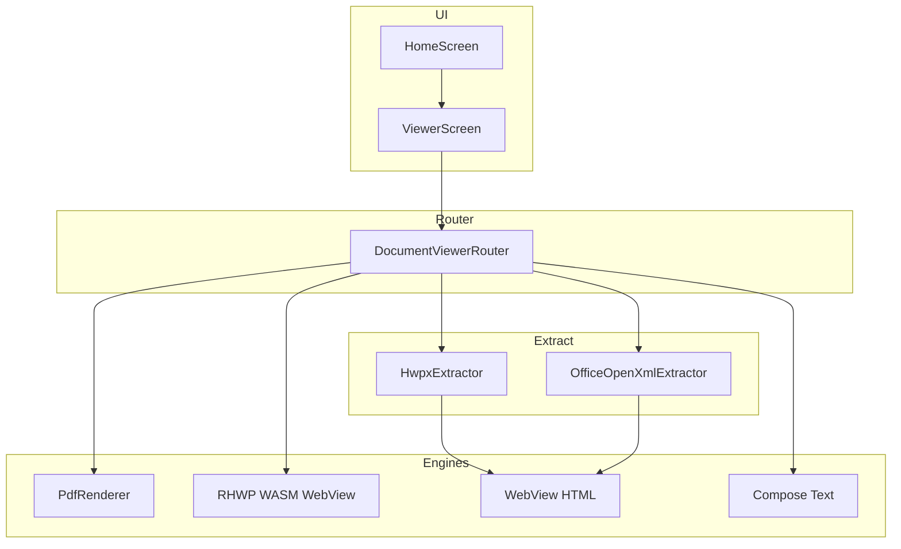

# 로피스뷰어 — Android 아키텍처 설계

## 1. 목표

Microsoft Office Viewer / Google Drive 미리보기와 유사하게, **설치형·오프라인·광고 없음** 문서 뷰어를 제공한다.  
편집 기능은 LoBooK 웹/데스크톱에 두고, 본 앱은 **열기 → 보기**만 담당한다.

## 2. LoBooK 리포 매핑

```
LoBooK (Next.js)                    →  Loffice Viewer (Android)
─────────────────────────────────────────────────────────────
RhwpCanvasViewer + rhwp_bg.wasm     →  HwpWebViewerScreen + assets/viewers/hwp/
HwpxHtmlViewer + hwpxExtractor.ts   →  HwpxExtractor.kt + WebHtmlViewerScreen
PdfPreviewPanel + pdfjs-dist        →  PdfViewerScreen (PdfRenderer 네이티브)
WordEditorPanel / mammoth           →  OfficeOpenXmlExtractor (DOCX)
LoOffice spreadsheet planned        →  OfficeOpenXmlExtractor (XLSX)
ppt export only                     →  OfficeOpenXmlExtractor (PPTX 텍스트)
detectFormat(registry.ts)           →  DocumentFormat.kt
LibreOfficeHub 탭 UX                →  HomeScreen + ViewerScreen TopAppBar
#2b579a / hancom-skin               →  LofficeViewerTheme (teal + blue)
```

## 3. 레이어 구조



## 4. Intent / 파일 열기

- `ACTION_VIEW` + MIME / 확장자 intent-filter
- SAF `OpenDocument` 피커
- `RecentDocumentRepository` — 최근 20건 SharedPreferences

## 5. 향후 확장 (v1.1+)

| 우선순위 | 기능 | 참고 OSS |
|----------|------|----------|
| P1 | DOCX 레이아웃 충실화 | [@microscope-js/renderer-docx](https://www.npmjs.com/package/@microscope-js/renderer-docx) WebView 번들 |
| P1 | PPT 슬라이드 이미지 | microscope renderer-pptx (LoBooK Phase 2 설계) |
| P2 | Excel 셀 스타일 | SheetJS / Apache POI Android |
| P2 | HWP 편집 | RHWP WASM 편집 API (현재 view only) |
| P3 | OCR | tesseract.js (LoBooK `documentOcr`) |

## 6. APK 크기

- `rhwp_bg.wasm` + `rhwp.js`: ~수 MB
- 네이티브 POI 미사용 → APK 슬림 유지
- ProGuard/R8 release 빌드 활성화

## 7. 보안·개인정보

- 네트워크: INTERNET 권한만 선언 (WASM 로컬 로드, 추적/광고 SDK 없음)
- 문서: 기기 로컬 URI만 처리, 업로드 없음
- Play 데이터 안전: **데이터 수집 없음** 선언 가능
